<h2 align="center" style="margin: 30px 0 30px; font-weight: bold;">openGauss Database Monitoring Plugin Generation Tool v1.0.0</h2>
<h4 align="center">Based on Vue/Element UI and a Java Full-Stack Rapid Development Framework</h4>

### Introduction to openGauss Database Monitoring Plugin Tool

Different customers may use different monitoring platforms to monitor their openGauss databases. To help industry customers use openGauss more securely and quickly, this universal monitoring plugin generator tool has been developed.

* It can generate monitoring plugins for Prometheus, Zabbix, and Nagios platforms based on customer-defined SQL queries.
* Includes 50 built-in common monitoring metrics, which can be deployed directly on existing platforms for full-stack monitoring of openGauss. These metrics cover commonly monitored indicators such as connection count, dynamic memory, shared memory, TPS, QPS, and long connections.
* To reduce platform compatibility issues, all plugins are implemented in Java. The tool supports Linux and Windows environments.
* Uses a full-stack (non-separated frontend/backend) architecture. The frontend (based on Vue/Element UI) provides database configuration, monitoring platform configuration, SQL validation, metric file generation, and metric publishing functionality.

### Features Supported by the openGauss Monitoring Plugin Tool

* Configure openGauss database connection information.
* Generate metrics from SQL queries.
* Publish a single SQL metric or multiple SQL metrics in batch across multiple hosts.
* SQL preview and history: view, modify, or delete historical SQL queries.
* Send metrics to the monitoring platform.
* View metrics on the monitoring platform.

### Limitations

* Requires Java 8.
* Users must have database access permissions. Recommended: read-only. The configured data source must be correct, and the database must be openGauss.
* Only `select` SQL statements are supported.
* For Prometheus, the exporter must be configured on the server.
* For Zabbix, the database connection info must be configured, and the Zabbix data repository uses MySQL.
* For Nagios, the client and server connection info must be configured.
* The deployment environment must be on the same network segment as the monitoring platform. Network interruptions may cause metric publishing failures.
* Supports Windows and Linux.
* Plugin restarts require Zabbix to reconnect the client, which takes about 2 minutes.
* The user must have the `MONADMIN` attribute (su - omm ;gsql -d postgres -p 5432;ALTER USER JIM MONADMIN). `JIM` is the user to whom the permission is added.

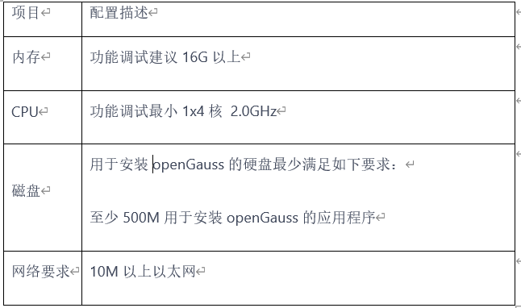

### System Modules

~~~
openGauss-tools-monitor
├── image                               // Project image resource   
├── monitor-tools                       // Sub-project        
        └── java
              └──common                 // Project common resource
              └──config                 // Spring basic configuration
              └──controller             // User access control layer
              └──entity                 // Entity class information
              └──exception              // Exception handling class
              └──manager                // Asynchronous processing class
              └──mapper                 // Data persistence layer
              └──preloading             // Project initialization loading class
              └──prometheustools        // Prometheus tool class
              └──quartz                 // Scheduled task management class
              └──util                   // Tool class
              └──MonitorPluginStart     // Project startup class
         └── resources
                 └── static             // Project static resource
                 └── application.yaml    // Basic project configuration file              
~~~

### Architecture

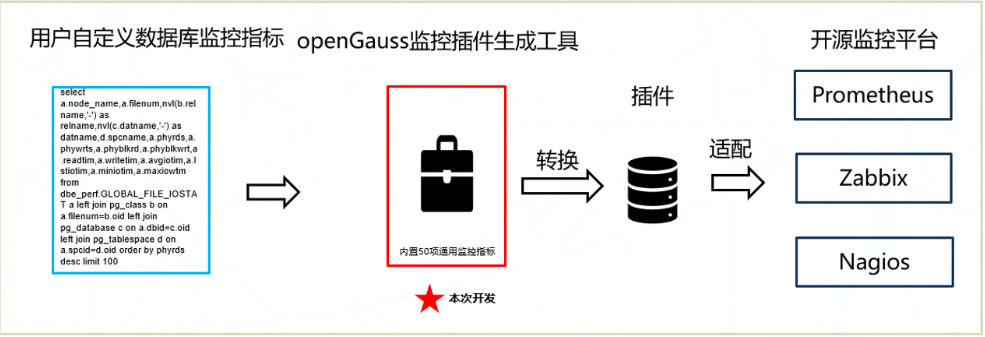

### Installing the Tool on Windows

#### 1. Install JDK.

* Example: Java 8
* Download from Oracle: https://www.oracle.com/java/technologies/downloads/
* Double-click the downloaded JDK and follow the prompts to install. Configure environment variables.
* Right-click My Computer → Properties → Advanced System Settings → Environment Variables.
* Add `JAVA_HONE` as the Java installation path.
* Add the `bin` directory to `PATH`, as shown in the following figure.
* Open the CLI and run `java -version`. If the output is `java version "Java version"`, the installation is successful.(java version "1.8.0_341")

<table>
    <tr>
        <td>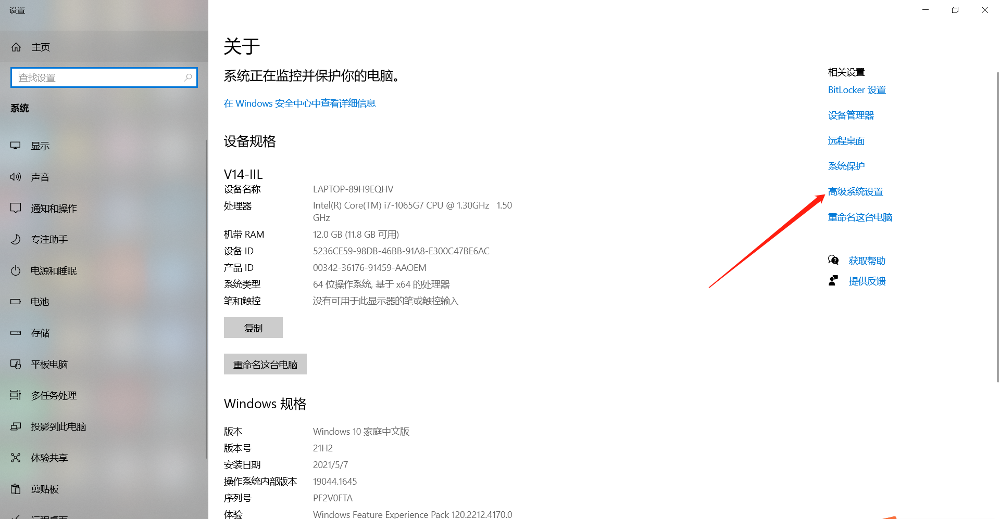</td>
        <td>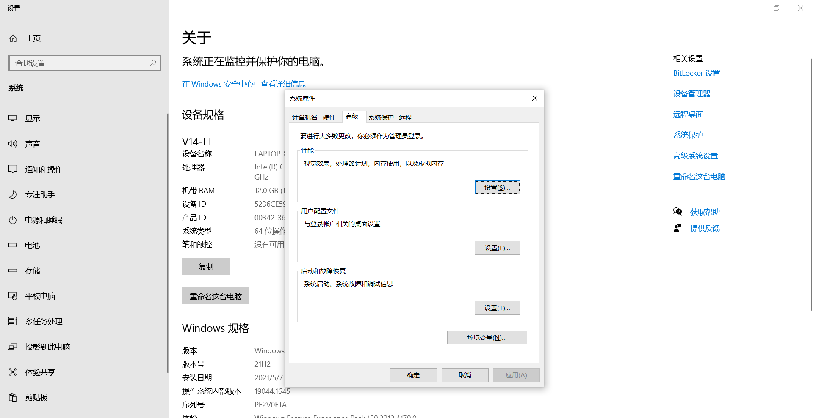</td>
    </tr>
    <tr>
        <td>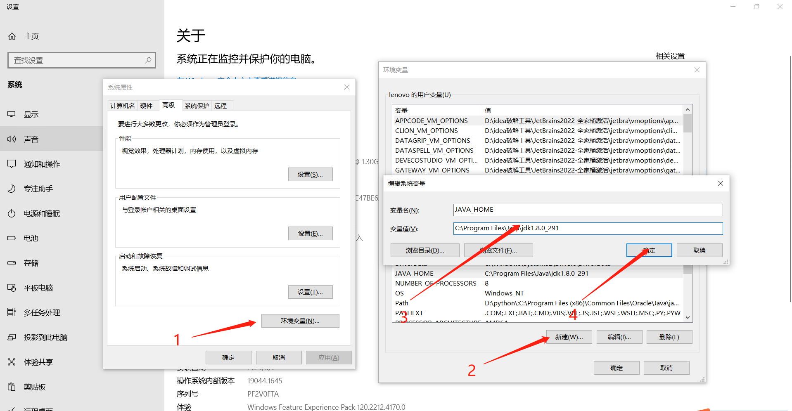</td>
        <td>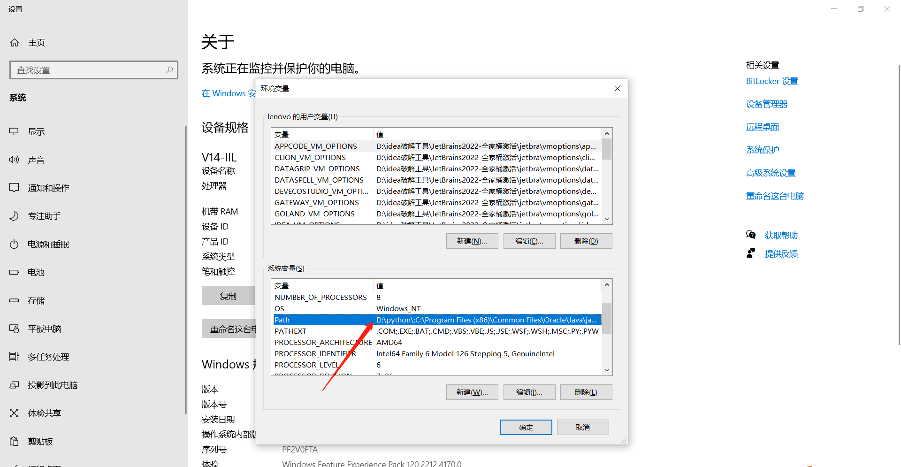</td>
    </tr>
    <tr>
        <td>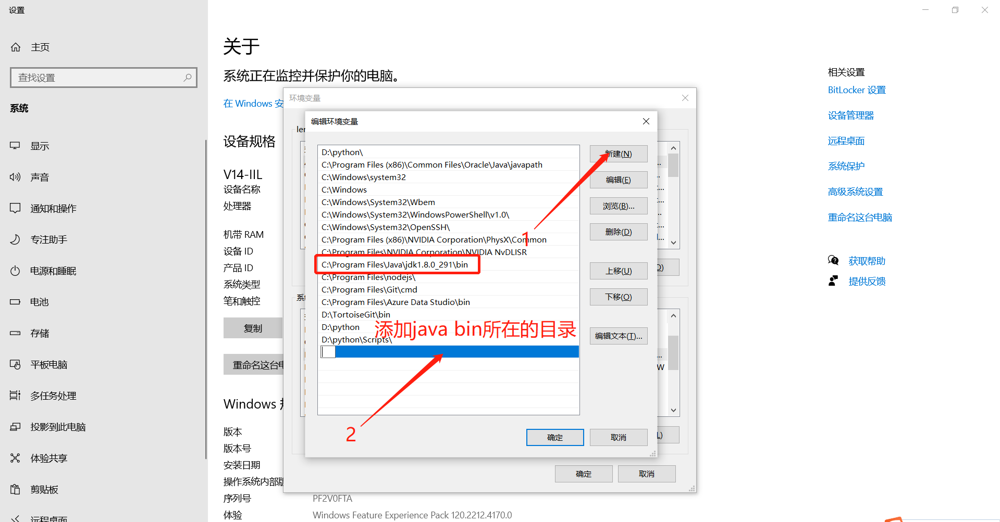</td>
        <td>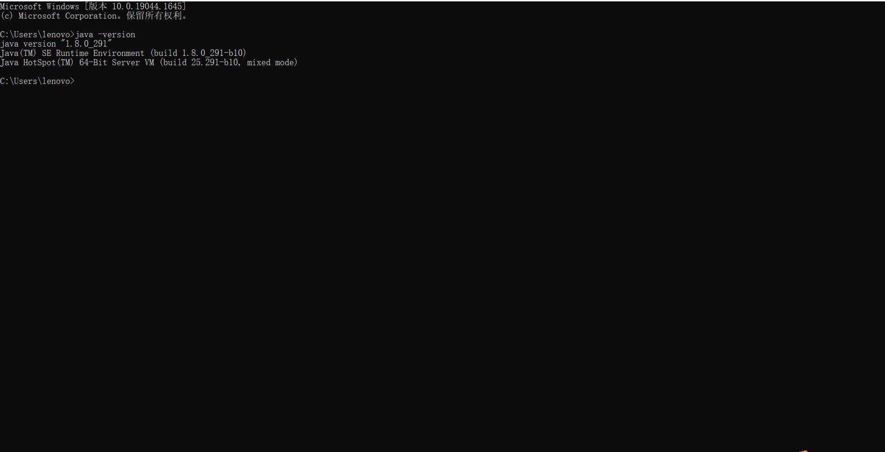</td>
    </tr>
</table>

### Installing the Tool on Linux (CentOS 7)

#### 1. Install JDK

* Download Linux version JDK 8 from Oracle: https://www.oracle.com/java/technologies/downloads/#java8
* cd /usr/local (Note: The directory is user-defined.)
* mkdir jdk
* Upload JDK to the `/usr/local/jdk` directory.
* Run the `tar -zxcv jdk-8u341-linux-x64.tar.gz` command.
* After the configuration is successful, configure the environment variables.
* vim /etc/profile
* Add the following commands:
* export JAVA_HOME=/usr/local/jdk/jdk1.8.0_341
* export CLASSPATH=$:CLASSPATH:$JAVA_HOME/lib/
* export PATH=$PATH:$JAVA_HOME/bin
* Update the environment variables: Run the `source /etc/profile` command.
* Check the Java version: Run the `java -version` command.

<table>
    <tr>
        <td>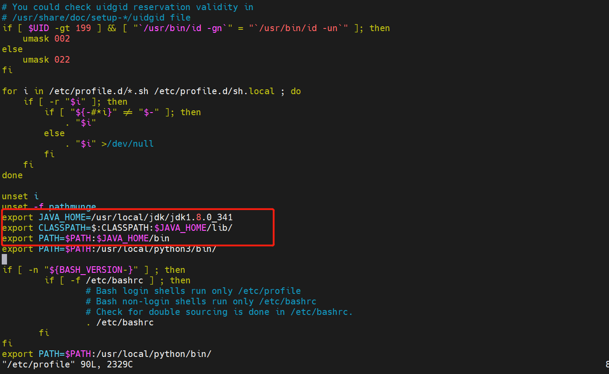</td>
        <td>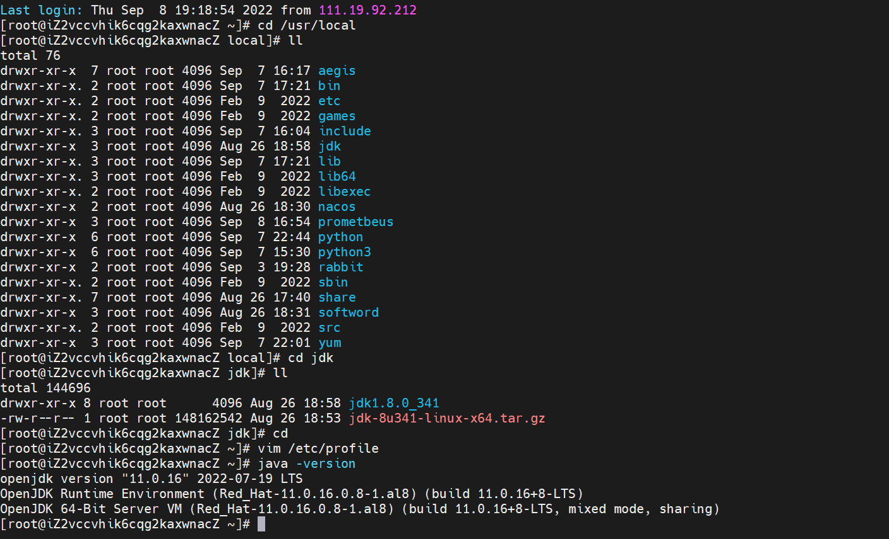</td>
    </tr>
</table>

#### 2. Install Docker
* If Docker of an earlier version has been installed, run the following commands to uninstall it:
  yum remove docker \
                    docker-client \
                    docker-client-latest \
                    docker-common \
                    docker-latest \
                    docker-latest-logrotate \
                    docker-logrotate \
                    docker-selinux \
                    docker-engine-selinux \
                    docker-engine \
                    docker-ce
* Install YUM utilities:
  yum install -y yum-utils \
                          device-mapper-persistent-data \
                          lvm2 --skip-broken
* Update the local image source:
  yum-config-manager \
                    --add-repo \
                     https://mirrors.aliyun.com/docker-ce/linux/centos/docker-ce.repo
                     sed -i 's/download.docker.com/mirrors.aliyun.com\/docker-ce/g' /etc/yum.repos.d/docker-ce.repo
                     yum makecache fast
* Install Docker.
   yum install -y docker-ce
* Docker commands:
  systemctl start docker # Start the Docker service.
  systemctl stop docker # Stop the Docker service.
  systemctl restart docker # Restart the Docker service.

#### 3. Build Dockerfile
* Refer to the project's Dockerfile for instructions.

### Using the openGauss Monitoring Plugin Tool - Windows

* Prepare environment: install JDK 1.8 (see Windows installation instructions above).
* Example using IntelliJ IDEA:
* Method 1: Start the tool via the startup class in IDEA.
* Method 2: Start via `java -jar monitor-tools.jar`.

<table>
    <tr>
        <td>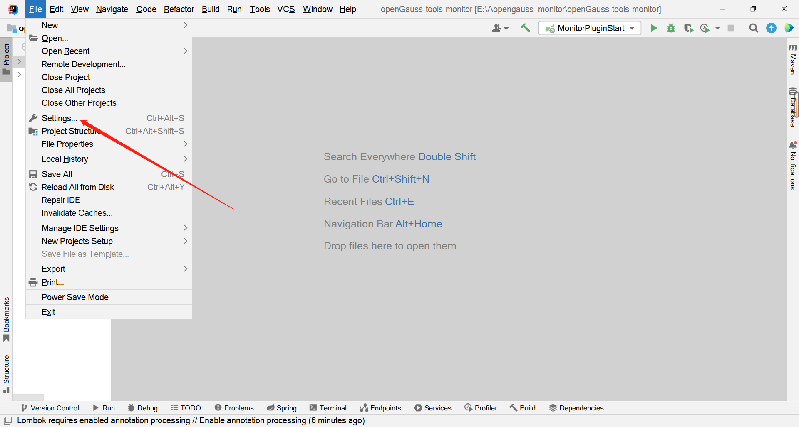</td>
        <td>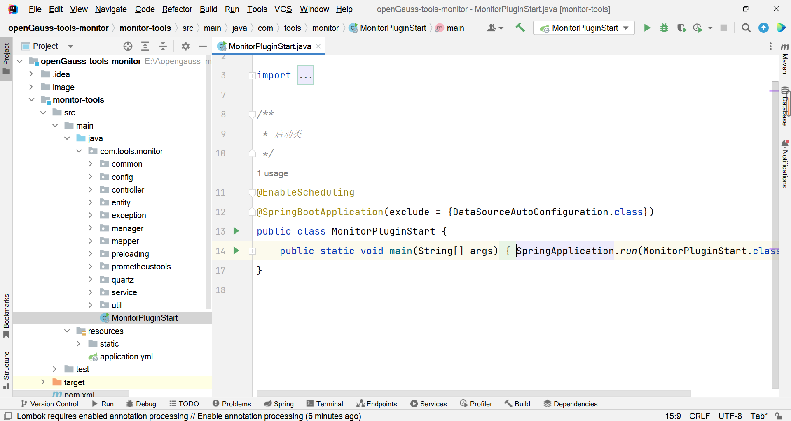</td>
    </tr>
    <tr>
        <td>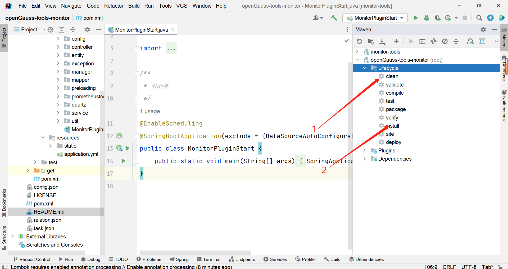</td>
        <td>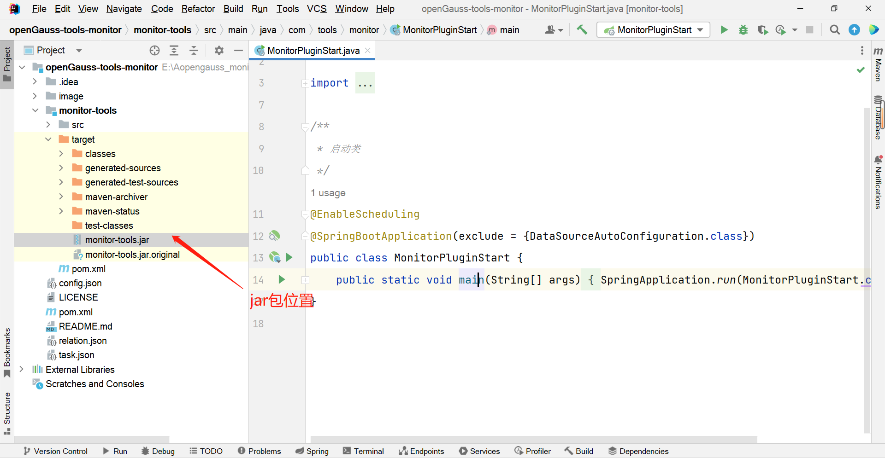</td>
    </tr>
</table>

### Using the openGauss Monitoring Plugin Tool - Linux

* Prepare environment: install JDK 1.8 (see Linux installation instructions above).
* Switch to a fixed directory, for example, `/usr/local`. To enter the directory, run the `java -jar monitor-tools.jar &` command to start the backend.
* Docker container deployment (custom directories and ports):
* mkdir /opt/docekerTest
* mv dockerfile /opt/docekerTest
* mv monitor-tools.jar /opt/docekerTest
* docker build -t web:1.0 . # `.` indicates Dockerfile directory
* docker run --name monitor -p 8085:8085 -v /opt/tools:/opt/tools -d web:1.0
* docker start monitor

### Demo

<table>
    <tr>
        <td>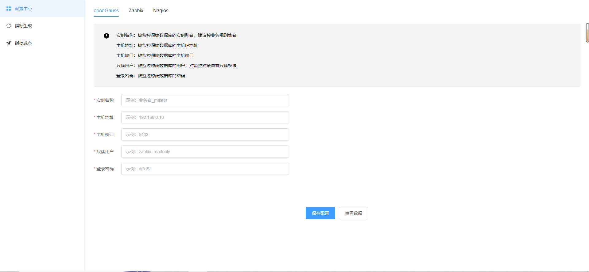</td>
        <td>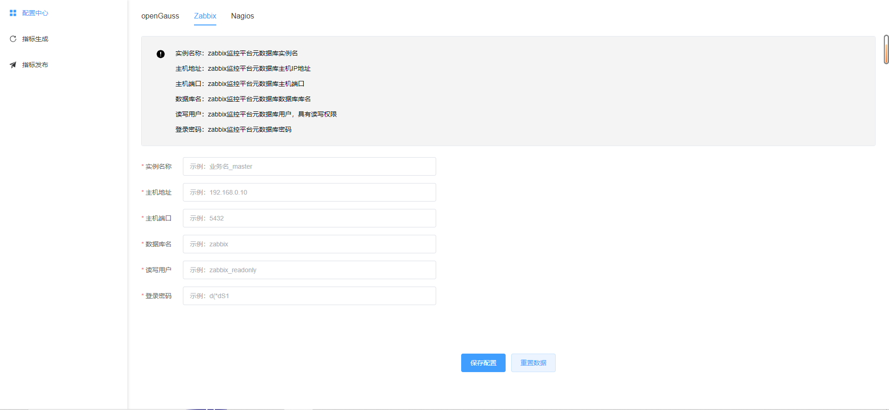</td>
    </tr>
    <tr>
        <td>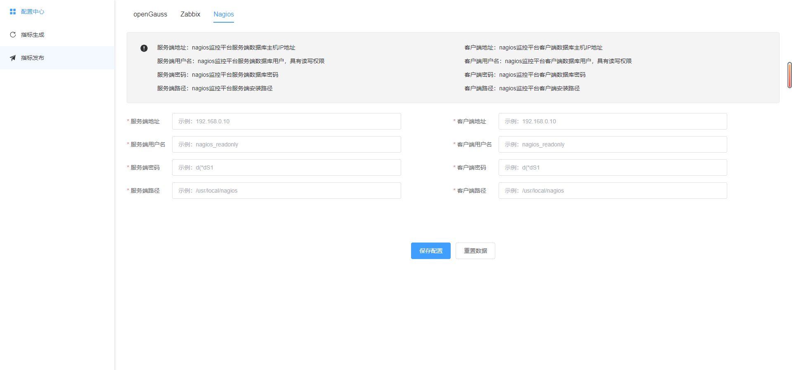</td>
        <td>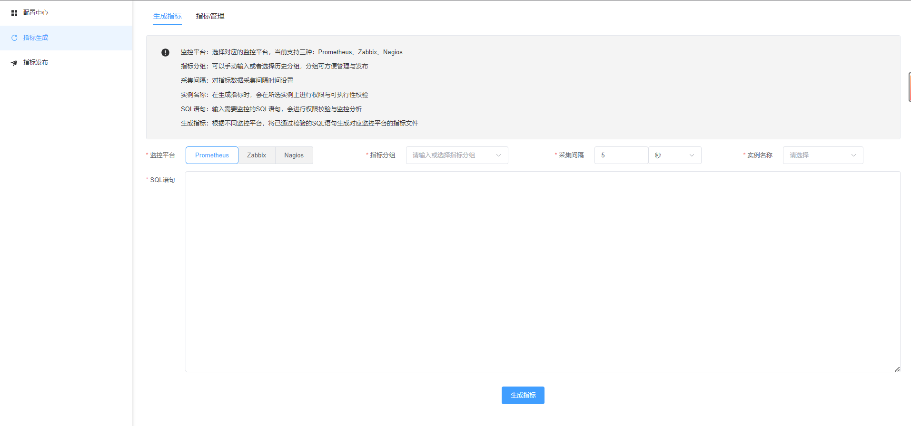</td>
    </tr>
    <tr>
        <td>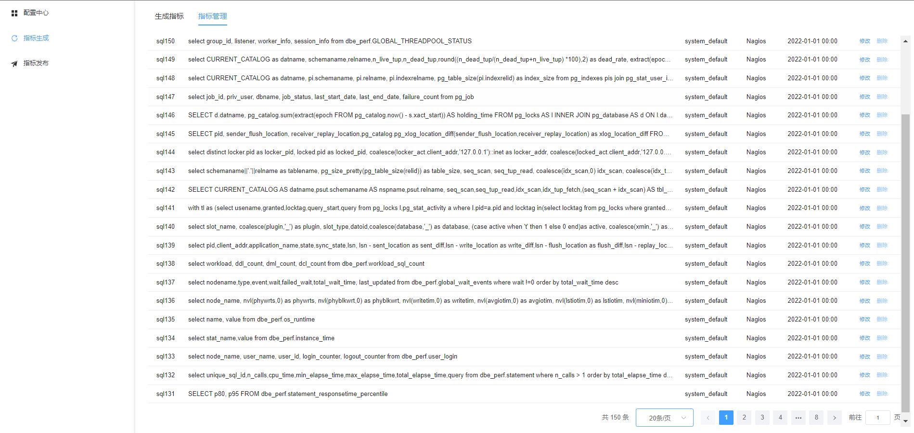</td>
        <td>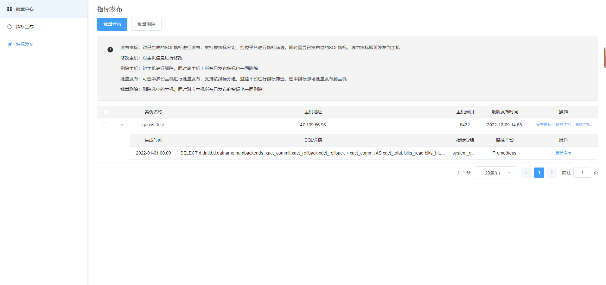</td>
    </tr>
</table>
